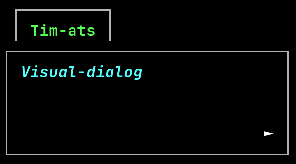

.. Visual-dialog documentation master file, created by
   sphinx-quickstart on Sat Mar  6 17:30:24 2021.
   You can adapt this file completely to your liking, but it should at least
   contain the root `toctree` directive.

Welcome to Visual-dialog's documentation
========================================

**Visual-dialog** is a **Python library** that allows you to make dialog box in a terminal easily.
**Visual-dialog** uses ``curses`` to display text in terminals.

**Features:**

- Automatic text scrolling.
- Text coloring and formatting.
- Hackable and configurable.

.. important::
   I recommend that you have some knowledge of Python ``curses`` module in order to use the library to its full potential.

   Here several links to learn ``curses``:

   - https://docs.python.org/3/howto/curses.html#curses-howto
   - https://docs.python.org/3/library/curses.html#module-curses

Getting started
---------------

- **First steps:**
- **Examples:** Many examples are available in the `repository <https://github.com/Tim-ats-d/Visual-dialog/issues>`_.

Getting help
------------

- If you're looking for something specific, try the :ref:`index <genindex>` or :ref:`searching <search>`.
- Report bugs in the `issue tracker <https://github.com/Tim-ats-d/Visual-dialog/issues>`_.

.. toctree::
  :maxdepth: 3
  :caption: Contents:

  requirements.rst
  installation.rst
  api.rst
  faq.rst

Changelog
---------

The list of versions and their changelogs can be found on repository:

- https://github.com/Tim-ats-d/Visual-dialog/releases/

